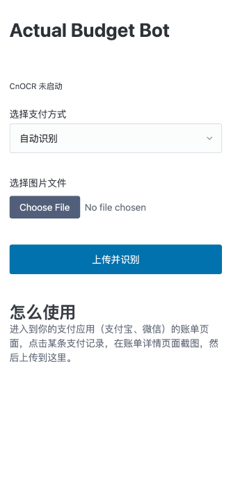

# actual-budget-bot

actual-budget-bot 一个自动导入交易信息到 actual budget 的应用。主要针对中国的常见支付应用（微信、支付宝、云闪付等）。

## 核心原理

- 对支付结果进行截屏（从支付宝、微信、云闪付等应用的账单详情页截屏）
- 把截屏上传到应用内
- 使用 cnocr 对图片进行OCR识别（区分支付应用）
- 将OCR结果转换成可用的交易数据
- 将交易数据导入 actual budget

### 自动识别支付应用原理

根据支付截图中的特征文案，识别支付应用

- 微信支付：`交易单号`
- 支付宝: `订单号`
- 云闪付: `订单编号`

### 界面预览

